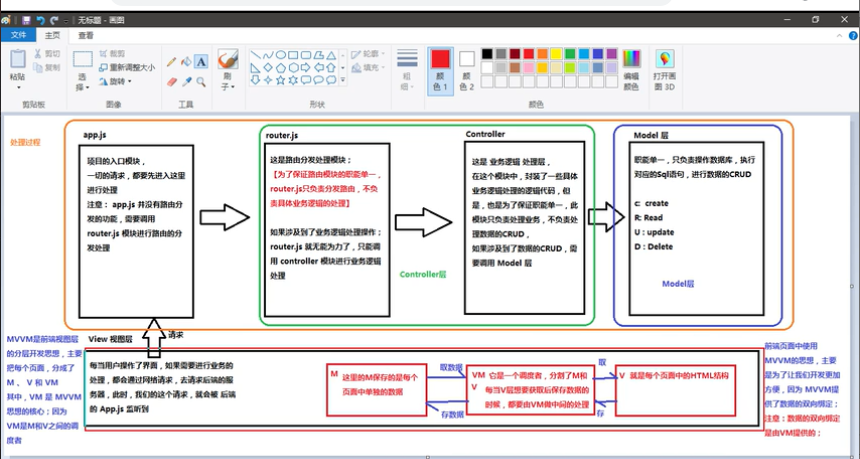

## 1.为啥要学习流行的框架

- 提高效率
- 在Vue中，一个核心概念是，就是让用户不在操作DOM元素，解放了用户的双手
##  2.框架和库的区别
- 框架：是一套完整的解决方案，对项目的侵入性很大，则需要重新整个项目
- 库（插件）：提供了某种工鞥，对项目侵入性很大，很好切换
## 3.Node(后端)中的MVC 与 前端中 MVVM有啥区别
- MVC是后端分层开发的概念
  - 每当用户操作了界面，如果需要进行业务处理，都会通过网络请求，去请求后端的服务器，此时我们的请求，就会被app.js监听到；
    - （1）app.js**项目的入口，一切请求都要进入这里进行处理，app.js并不具有路由分发的功能，需要调用router.js 模块进行路由分发处理** 
    - （2） router.js**为了保证路由模块的智能单一，router.js只负责分发路由，不负责逻辑的处理，如果涉及相关业务逻辑的处理，router.js无法处理，只能调用controller模块**
    - （3）controller **是具体业务逻辑处理的代码，此模块值负责处理业务，不负责处理数据的CRUD，如果需要处理数据，需要调用model层**
    - （4）model **负责连接数据库，进行数据CRUD操作**，
- MVVM 是前端视图层的概念，前端使用该思想，是为了开发更加方便，数据的双向绑定，是VM提供的。主要是关注于
  - MVVM 是针对前端视图层的分层开发思想，主要是把每个页面分为：M、V、VM，其中VM是MVVM思想的核心，因为VM是M和V之间的调度者
  - M：是保存的每个页面的单独的数据，
  - VM：是一个调度者，分割M和VM，是一个中间层，每当V层想要获取保存数据的时候，都需要VM来做中间的处理
  - V：就是每个页面中的html结构
  - 
## 5.vue.js基本语法
- 1.使用mvc 和mvvm的区别
- 2.vue 基本的代码结构
- 3.学习来基本指令：插值表达式，v-cloak v-if，v-for，v-binf，v-show，v-on，v-model，v-html
- 4.事件修饰符：stop prevent capture self once
- 5.el 指定控制的区域，data是个对象，制定了控制的区域内用到的数据，methods 虽然带s 但是是个对象，这里可以自定义方法
- 6.在vm实例中，如果要访问data中的数据，或者访问methods中的方法，必须使用this
- 7.v-for中使用key属性，（只接受string/number）作为唯一key
- 8.v-model 只能应用于 表单元素
- 9.在vue中，绑定样式的两种方式：v-bind.class 和v-bind.style
- 10.vue中watch 的作用是监控一个值的变化，并调用因变化需要执行方法，可以通过watch改变关联的状态
- 11.过滤器调用的格式{{name | 过滤器的名称(arg,arg2)|fiter2}}}；支持传参，和多个过滤器一起使用，**两个地方：mustache插值，v-bind表达式 过滤器 调用原则是 就近原则，如果全局和私有的过滤器一致， 会优先调用私有的**
     过滤器中的 function中第一个参数，已经被规定死了，永远都是 过滤器 管道符前面传递过来的数据
          Vue.filter('过滤器的名称',function (data,arg,arg2) {
              return data +'123';
          })
- 12.ES6 string.protype.padStart(maxLength,str),长度不足length 补充str   例如： var ss = dt.getSeconds().toString().padStart(2,'0');
- 13.按键修饰符@keyup.enter 自定义键盘码的值 @keyup.113---->F2  Vue.config.keyCodes.f2=113
- 14.自定义全局的指令 v-focus; 参数1：指令名称，注意定义的时候，不需要加v-的前缀参数
    一个对象，这个对象身上，有一些指令相关的函数，这个函数会在特定的阶段执行相关的操作
    注意在每个函数中，第一个参数永远是el，代表被绑定的那个元素，这个el参数代表的 一个原生JS对象
- 15.vue 实例的生命周期
- 

- 16. vue 实例的生命周期
       + 1.表示开始创建一个Vue对象
       + 2.初始化一个空的vue对象，这个时候，这个对象身上，只有默认的一些生命周期函数和默认的时间，
       + 3.beforeCreate() 是第一个生命周期函数，表示实例创建出来之后会被创建，注意：在beforeCreate生命周期函数执行的时候，data和methods中的数据都还没有初始化。
       + 4.**created**()  是第一个生命周期的函数，这是 data 和methods中的数据已经初始化完成
       + 5.-----此处有编译模板。。。
       + 6.beforeMount()//第三个生命周期的函数，表示模板已经在内中编译完成，但是尚未把模板渲染到页面中
       + 7.------替换  5.条目中 编译好的模板
       + 8.**mounted**()//第四个生命周期函数，表示内存中的模板，已经真实的挂在到来页面中，用户已经可以看到渲染好的页面了,//注意：mounted是实例创建期间中，最后一个周期函数，当执行完mounted方法就表示，实例已经被完全创建好了，此时如果没有其他操作的话，这个实例就静静的一动不动。
       + 9.运行中：mounted --- mounted 动作中，当数据发生变化中，将会调用beforeUpdate() 和 updated()方法
       + 10.beforeUpdate()
       + 11.虚拟DOM重新渲染并应用更新：此处是先根据data中最新的数据，在内存中，重新渲染出来一份最新的内存DOM树，重新渲染的这个树被更新之后，会把最新的DOM树，重新渲染到真实页面中去，这时候，就完成了数据从data（model）到view的更新
       + updated()该事件执行之后，页面的data数据已经保持同步了，都是最新的	
       + 当执行beforeDestroy钩子函数时，VUE实例已经从运行阶段，进入了销毁阶段，实例身上所有的data、methods、过滤器、指令.... 都处于可用状态，此时还没有真正的执行销毁的过程
       + 当执行Destoryed方法时，组件已经被完全销毁了，组件中所有的数据，方法，指令，过滤器....  都不可用
- 17. vue-resource 实现ajax的请求
       + v-resource依赖 vue，因此引入的时候有顺序
       + [ vue_resource 文档][https://github.com/pagekit/vue-resource/blob/HEAD/docs/http.md]
       + JSONP的实现原理：
            + 由于浏览器的安全性限制，不允许ajax访问协议不同，域名不同，端口号不同的数据接口，浏览器认为这种访问不安全，
            + 可以通过动态的创建script标签形式，把srcipt标签的src属性，执行数据接口的地址，因为script标签不存在跨域的限制，这样数据获取方式，称作JSONP，此方法值支持get方法
            + **注意**：如果我们使用全局配置的 请求接口  根域名，每次单独发送http请求时，请求的url路径，应该以**相对路径**来开头，前面不能有 **/**  ，否则 不会启用根路径拼接
       + 全局配置emulateJSON  Vue.http.options.emulateJSON = true;
- 18. vue中的动画
       + 一个好的动画，让用户更好的理解产品
       + 
       + Vue 提供了 transition 的封装组件 使用这个元素来包裹元素的
       + v-enter：定义进入过渡的开始状态。在元素被插入之前生效，在元素被插入之后的下一帧移除。
       +  v-enter-active：定义进入过渡生效时的状态。在整个进入过渡的阶段中应用，在元素被插入之前生效，在过渡/动画完成之后移除。这个类可以被用来定义进入过渡的过程时间，延迟和曲线函数。 
       +  v-enter-to: 2.1.8版及以上 定义进入过渡的结束状态。在元素被插入之后下一帧生效 (与此同时 v-enter 被移除)，在过渡/动画完成之后移除。
       +  v-leave: 定义离开过渡的开始状态。在离开过渡被触发时立刻生效，下一帧被移除。
       +  v-leave-active：定义离开过渡生效时的状态。在整个离开过渡的阶段中应用，在离开过渡被触发时立刻生效，在过渡/动画完成之后移除。这个类可以被用来定义离开过渡的过程时间，延迟和曲线函数。
       + v-leave-to: 2.1.8版及以上 定义离开过渡的结束状态。在离开过渡被触发之后下一帧生效 (与此同时 v-leave 被删除)，在过渡/动画完成之后移除。

  19. ### [JavaScript 钩子](https://cn.vuejs.org/v2/guide/transitions.html#JavaScript-钩子)
  
       可以在属性中声明 JavaScript 钩子
  
       ```
       <transition
         v-on:before-enter="beforeEnter"
         v-on:enter="enter"
         v-on:after-enter="afterEnter"
         v-on:enter-cancelled="enterCancelled"
       
         v-on:before-leave="beforeLeave"
         v-on:leave="leave"
         v-on:after-leave="afterLeave"
         v-on:leave-cancelled="leaveCancelled"
       >
         <!-- ... -->
       </transition>
        
       ```
        + 当只用 JavaScript 过渡的时候，在 **enter** 和 **leave** 中必须使用 **done** 进行回调。否则，它们将被同步调用，过渡会立即完成。 
       
        + ```
          
          beforeEnter 是表示动画入场之前，此时 动画 尚未开始，可以在该方法中设置元素的开始动画之前的起始样式 
          enter表示动画开始之后的样式，这里 可以设置小球完成动画之后的 结束状态
          afterEnter 动画完成之后的动作
          
          ```
       
        +  如果要为v-for来添加动画时 必须要是为元素 设置 ：key 属性，渲染动画时 需要使用transition-group来包裹对应元素
       
        + .v-move 和 v-leave-active 配合使用，可以能够让列表后续的元素，渐渐的移动
       
        + 给transition-group 添加 appear 属性，实现页面刚入场时的效果
       
        + 给transition-group 添加 tag 属性，可以指定transition-group 渲染的元素，如果不指定 默认渲染为span 元素
       
        + 
       
        + 
       
  20. vue的组件
  
       + 组件是什么：组件的出现，未来拆分vue实例的代码量，能够让我们以不同的组件，来划分不同的模块，不同的模块对应不同的功能
       
       + 组件化和模块化的不同：
         + 模块化：是从代码逻辑上 划分的；方便代码分层开发，保证每个功能模块的职能单一 --node
         + 组件化：是从UI界面的角度划分；方便UI组件的使用-前端的组件化，--vue
         
       + ```vue
         如果使用Vue.component使用驼峰命名（myCom1），引用是 要用 - 来表示（my-com1）
         全局的三种方式：
         1.1使用 Vue.extend 创建全局的Vue组件
         var com1 = Vue.extend({
             template: '<h3>这是个Vue.extend创建的组件</h3>' //通过template属性，指定组件要展示的html结构
         });
         1.2 使用Vue.component('组件名称'，extend创建的组件)
         2.1 使用Vue.component('组件名称'，扩展出来的组件模版对象
         注意：无论是使用哪一种方式创建的组件，组件template的属性所指向的模板内容，必须有且只有唯一的根元素
         3.1 被控制的#app 的外面，定义使用的template元素，定义的html的模板结构
         定义私有组件：
         vm 实例中：components:{//定义实例内部私有组件的
                     'login':{
                         template: '<h1>这是私有的login 组件</h1>'
                     }
         ```
         
        +  组件中可以有data和methods 
            - 1.组件可以有data
            - 2.组件的data和实例中的data不一样，实例中的data可以是一个对象，但是组件中的data是个方法，
            - 3.组件中的data除了必须是一个方法之外，这个方法内部，必须返回一个对象才行
            - 4.组件中的data数据，使用方式和实例中的data使用方式完全一致
            
        + 组件之间的切换
            -  v-if 和 v-else  也可以实现
            -  vue 提供了 component 来展示对应名称的组件;component 是个占位符，：is属性，可以用来指定展示的组件名称 <component :is="comName"></component>
            
       + 总结 目前学习的几个Vue提供的标签
       
            + Component   template  transition  transistion-group
       
       + 多个组件的过渡，依旧使用transition 标签
       
            + ```
                  <transition model="out-in">
                         <component :is="comName"></component>
                     </transition>
                 mode 属性，设置组件切换的模式
              ```
       + 父组件和子组件
            - 数据的传递 ：父组件需要使用v-bind指令，将需要传递给子组件的数据，以属性的形式传递给子组件，子组件在使用的是否需要 使用props数组去 定义一个于父组件绑定属性名称相同的值， props中的值 与组件中 data的区别在于：data时可读可写的，但是prop中的值 时只读的
            
            - 方法的传递：父组件需要hi 使用v-on指令，将需要传递给子组件的方法，以事件绑定机制的形式，传递给子组件，子组件可以通过通过this.$emit(''属性值')去触发这个方法 
            
            - ```
              //emit 英文原意：触发 调用 发射的意思
              this.$emit('func', 123, 456)//123 455 是这个方法的参数
              ```
            - 子组件可以通过调用父组件的方法，传递自己的参数给父组件，变相的实现：子组件向父组件传值
  + 21 路由
       + 什么是路由：
         + 后端路由：对于普通的网站，所有的链接都是url地址，这写url地址，对应的是服务器上的资源
         + 前端路由：对于单页面来说，主要是通过url中的hash（#号）（http://baidu.com/#/login）来实现页面的之间的跳转，同时，
         hash有个特点，HTTP请求不会包含hash相关的内容，所以 单页面程序中的页面跳转，主要通过hash来实现的。**在单页面程序当中，通过hash改变来实现切换页面的方式。称为前端路由**
         
       + 如何使用：
       
         + 相关步骤
       
         + ```
           1. 引入包
           2.创建一个路由对象，
           3.当导入v-router包之后，在window 全局对象中有存在一个路由构造函数，，VueRouter
           4.在 new VueRouter 对象中，可以传递一个配置对象
           5.路由规则对象，注册在vm实例上，用来监听url地址的变化，然后展示对应的组件
           6.在对应的vue控制的区域内 使用 router-view 占位；router-view 是v-router中提供的元素，用作占位符，将来 路由规则匹配到的组件，就会展示到这个router-view中
            /*router-link 的默认 class 可以修改， 在vue-router的构造函数中，修改:linkActiveClass*/
           ```
         
       + 路由的传参：
          + 方式一：    <router-link to="/login?id=10"> login</router-link>// {path: '/login', component: login},
          + 方式二：    <router-link to="/login/12/lisi"> login</router-link>// {path: '/login/:id/:name', component: login},
          
       + 路由的嵌套：
       
          + ```vue
             var routerobj = new VueRouter({
                     routes: [
                         {
                             path: '/account',
                             component: account,
                             children: [
                                 {path: 'login', component: login},
                                 {path: 'register', component: register}
                             ]
             
                         }
                     ]
                     // {path: '/account/login/:id/:name', component: login},
                     // {path: '/account/register', component: register},
                 })
             ```
          
       + 命名视图
         
         +  
           
           ```
           给对应的视图命名：
           <router-view></router-view>//defalut header
           <router-view name="left"></router-view>
           <router-view name="main"></router-view>
           
           
           // 单个组件 展示在同一界面上
           var routeObj = new VueRouter({
                   routes: [{
                       path: '/',
                       components: {
                           'default': header,
                           'left': leftbBox,
                           'main': mainBox
                       }
                   }]
           
               })
           ```
       
  + 22.vue中watch命令:监听数据的变化
    
    + ```vue
      //监听变量的变化
      watch: {
          'first_name': function (newValue,oldValue) {
              this.full_name = newValue + '-' + this.last_name
          },
          'last_name': function (newValue) {
              this.full_name = this.first_name + '-' + newValue
          }
      
      }
      
      -------------------------------------------------------------------
      //监视路由地址的变化
      watch: {
                  '$route.path': function (newValue,oldValue) {
                  	if (newValue =='/login'){
      					console.log('welcome login ')
      				} else if (newValue =='/register'){
      					console.log('welcome register')
      				}
      
                  }
              }
      ```
    
  + 23.computed 计算属性： 称为计算属性，本质是一个方法。只不过是在使用的时候，是把它的名称属性来使用，并不会像调用方法那样 使用
    
    + ```
      computed: {
          //在 computed中，可以定义一些属性，这些属性 称为计算属性，这些计算属性，本质是一个方法。只不过是在使用的时候，是把它的名称属性来使用，并不会像调用方法那样 使用。
          //注意1： 计算属性 调用的时候没有 括号，按照 普通的属性 去使用
          //注意2： 计算属性 function内部 所用到的数据 只要发生变化，都会被重新计算，
          //注意3： 计算属性的值的求值结果会被 缓存起来，如果计算属性的function中没有任何一个值发生变化，计算属性的值 是不会发生变化的，不会重新计算的
          'full_name': function () {
              console.log('ok');
              return this.first_name + '- ' + this.middle_name + '-' + this.last_name
      
          }
      }
      ```
    
  + 24. watch、computed、methods 的区别
    + computed：结果会被缓存，除非依赖的属性，变化时才会重新计算，主要是当作 属性 来使用
    + methods:方法具体表示一个操作，主要是书写业务逻辑
    + watch:一个对象，键是需要观察的表达式，值是对应的回调函数，主要是用来监听某些业务数据的变化，从而进行一些具体的业务逻辑的处理，可以看作是computed和methods的结合体
    
  + 25 render 的使用：render定义的组件，将会替换整个**el指定的容器**
  
       + ```
            var login = {
                template: "<h1>this is login render （替换整个app）</h1>"
            };
            var vm = new Vue({
                el: '#app',
                data: {},
                methods: {},
            
                // components:{
                //     login
                // }
                render: function (createElement) {
                    //return 的内容会替换 el中指定的那个容器
                    return createElement(login)
                }
            ```
## 6. nrm工具--使用
   + 1.作用：提供了一些常用的镜像地址，能够让我们快速的切换安装包时候的地址
   + 2.使用：运行：''npm -i nrm -g' 安装nrm
            运行''nrm ls' 列出所有的镜像
            运行''nrm use npm' 或者 'nrm use taobao' 切换不同的镜像地址

    > 注意：nrm只是单纯的提供几种常用的镜像地址，下载 包 的地址，并能够让我们在几个地址之间相关切换，但是每次装包的时候，使用的装包工具 都是***npm***
## 7. Webpack学习
   ### 1.在网页中，常见的静态资源有哪些？

      - .JS 后缀名（.js  .jsx .coffee  .ts）
      - .CSS 后缀名（.css .less .sass .scss）
      - .Images 后缀名（.jpg .pong .jpeg .gif .svg） 
      - .字体文件 后缀名（.svg .ttf .eot .woff . woff2）
      - .模板文件 后缀名（.ejs .jade .vue【这是webpack中定义的组件，推荐使用方式】）
    
    ### 2. 网页中引入静态资源多了有啥问题？
      - 网速加载速度慢，因为它会发出很多二次请求
      - 要处理错综复杂的依赖关系
    ### 3. 如何处理此问题？
      - 合并 压缩 精灵图 图片的base64编码
      - 可以使用requireJS 也可以使用webpack 去解决各个包之间的复杂关系

   ### 2.什么是webpack？

    - webpack是一个前端项目构建工具，它是基于node.js 开发出来的工具
    + 5. 解决题目2中的问题的两种方案？
      - gulp 基于task任务 ---小 灵活
       - webpack 基于项目构建--- 宏观
     
    + 6. [webpack官网]: https://webpack.js.org/

  ###   3.安装webpack
  - 安装node.js    

   - npm install webpack -S

###4.如何使用webpack？

  - ```
    webpack4 默认不需要再创建webpack.config.js来配置打包的入口和出口；
      
      默认情况下，
     
     入口为./src/index.js文件
     
     出口为./dist/main.js文件
    ```

     

 - **webpack.config.js**

      ```javascript
      const path = require('path');
      
      module.exports = {
        entry: './path/to/my/entry/file.js',
        output: {
          path: path.resolve(__dirname, 'dist'),
          filename: 'my-first-webpack.bundle.js'
        }
      };
      ```
 - *** webpack ./src/main.js  ./dist/bundle.js ***

      - ``` 
         webpack ./src/main.js  ./dist/bundle.js 
         webpack   entry    outout
         webpack   输入（打包文件）   输出文件位置
         //webpack
         //1.webpack  能够处理JS文件的相互依赖关系
         //2.webpack  能够处理JS文件的兼容性问题
         ```

- 使用webpack-dev-server 来实现自动打包和编译
   - 使用npm i webpack-dev-server -D 安装这个工具
   	
   	- 由于是在本地安装的此工具，不能直接在shell中使用
   	
    - 将会托管该项目：http://localhost:8080/src/

    - webpack-dev-server 帮我打包生成的main.js文件，为了运行部署，响应快，并没有实际的存放在物理磁盘上，直接托管到了***内存中***，实际找不到对应的文件。http://localhost:8080/main.js 

    - Webpack-dev-server 一些参数

       - 方式一：

    - ```
      
      "dev": "webpack-dev-server  --open --port 3000",
      参数：
      --open 默认打开浏览器 
      --port:修改默认8080 端口为 3000
      --contentBase: 指定默认浏览器打开时候的显示的页面
      --hot:热部署，热加载，是以打补丁的方式 实现的， 可以自动刷新更改的样式
      
      
      ```
      
   - 方式二： 如果不是用webpack-dev-server 如果在package.cofig.js中设置 热部署

       - ```
           const path = require('path');
           const webpack = require('webpack');//启动热部署的第二步
           //配置文件就是一个js文件，通过Node中的模块操作，向外暴露一个配置对象。
           module.exports = {
               entry: path.join(__dirname, './src/index.js'),//入口,要使用webpack打包那个文件。
               output: {//输出文件的配置
                   path: path.join(__dirname, './dist'),//指定到那个目录中去
                   filename: "bundle.js"//指定输出文件的名称
               },
               //webpack-dev-server 的第二种配置方式
               // --open --port 3000 --contentBase src
               devServer:{
                   open:true,//启动打开浏览器
                   port:3000,//指定端口
                   contentBase:'src',//指定浏览器启动的目录
                   hot:true,//启动热部署的第一步
                   //
               },
               plugins:[
                   //配置插件阶段
                   new webpack.HotModuleReplacementPlugin()// new 热更新插件的对象，热部署启动
               ]
           
           };
           ```
           

  - html-webpack-plugin 
    
     - 安装：npm  i html-webpack-plugin  -D
     	
     	- 使用html-webpack-plugin之后 ，会自动打包好的main.js追加到 该插件渲染的内存中的页面中
     	
     	- ```
     	   //	导入html-webpack-plugin插件
     	   const htmlWebpackPlugin = require('html-webpack-plugin');
     	   
     	   //new 一个插件对像
     	   new htmlWebpackPlugin({//创建这个插件
     	       //指定模板页面，将来会根据这个指定的页面去生成内存中的页面
     	       template: path.join(__dirname,'./src/index.html'),
     	       filename: 'index.html'//指定生成的页面的名称
     	   })
     	   ```
     	
     	   +    指定配置文件运行
     	
     	     ```
     	     "scripts": {
     	       "dev2": "webpack-dev-server  --open --port 3000 --contentBase src ",
     	       "dev": "webpack-dev-server --config ./package.config.js",
     	       "test": "echo \"Error: no test specified\" && exit 1"
     	     },
     	     ```

  - webpack 默认只能打包js文件，不能处理css这种文件，如果需要处理这种 非JS 文件，需要手动安装第三方 loader 加载器

     - 安装 npm i style-loader css-loader -D
     - webpack 处理第三方文件类型过程
        - 1. 如果发现不是JS，然后去配置文件中 查找有没有对应的第三方loader规则
           2. 如果能匹配到 就会调用对应的loader 去处理这种文件类型
           3. 在调用loader的时候 是从后往前 调用的，
           4. 当最后的一个loader 也就是最左边，会将结果交给webpack 进行打包合并
     - 使用方式： 同右到左

     ```
     在 package.config.js中 配置
     配置插件阶段
         plugins: [
             new webpack.HotModuleReplacementPlugin(),// new 热更新插件的对象，热部署启动
             new htmlWebpackPlugin({//创建这个插件
                 //指定模板页面，将来会根据这个指定的页面去生成内存中的页面
                 template: path.join(__dirname,'./src/index.html'),
                 filename: 'index.html'//指定生成的页面的名称
             })
         ],
         module:{// 所有的第三方插件的加载器
             rules:[
                 {
                     test:/\.css$/,//正则匹配
                     use:['style-loader','css-loader']//匹配成功的使用两个第三方插件
                 }
             ]
         }
     ```

  - Url-loader loader的使用

  - ```
    //limit参数： 限制多少大小修改图片编码为base64
    
    // limit >= 图片大小（byte） 可以转化为base64
    // limit <= 图片大小（byte） 不可以转化为base64 ，会修改图片的名字
    // name参数 可以修改图片的相关文件名   hash保证文件名唯一 可以使用name参数进行修改 
      test: /\.(jpg|jpeg|png|gif|bmp)$/, use: 'url-loader?limit=1&name=[hash:8]-[name].[ext]'// 图片路径  处理url 可以传参，修改相关属性,
      test: /\.(ttf|eot|woff|woff2|svg)$/, use: 'url-loader'//处理字体的loader
    }
    ```

     - import  'bootstrap/dist/css/bootstrap.css'     注意 如果要是以路径的形式，访问node——module下的文件，可以省略 路径前的node_module 这一级的目录    默认就是在node_module下去寻找

     - webpack中  如何打包高级的语法 ES6 ES7 

       - ```
        //访问 静态属性上的info
        //在webpack中默认只能处理一部分ES6语法，一些高级的是处理不了，需要第三方loader去处理，然后由webpack出打包到bundle.js中
        //通过 Babel 可以将高级的语法转发为低级的语法
        //在webpack中 可以运行一下命令 安装两个包 去安装Babel
        //第一套：npm i babel-core babel-loader babel-plugin-transform-runtime -D
        //第二套：npm i babel-preset-env babel-preset-stage-0 -D
        ```
        ```
       
        ```

        ```
       
        ```

        ```
       
        ```

        ```
       
        ```

        ```
       
        ```
       
        ```
       
        ```
       
        ```
       
        ```
       
        ```
       
        ```
       
        ```
       
        ```
       
        ```
       
        ```
       
        ```
       
        ```
       
        ```
       
        ```
       
        ```
       
        ```
    ```
    
    ```
  
 - 通过 ***Babel*** 可以将高级的语法转发为低级的语法
        命令详情：
     
        在webpack中 可以运行一下命令 安装两个包 去安装Babel
       第一套：npm i babel-core babel-loader babel-plugin-transform-runtime -D
       第二套：npm i babel-preset-env babel-preset-stage-0 -D
     
    ```
    第一步：装loader
        //  在webpack中 可以运行一下命令 安装两个包 去安装Babel
        //第一套：npm i babel-core babel-loader babel-plugin-transform-runtime -D
        //第二套：npm i babel-preset-env babel-preset-stage-0 -D
    第二步：配置 webpack.conf.js
       //打开配置文件  在module总的rules 添加新的匹配规则：{test:/\.js$/,use:['babel-loader'],exclude:/node_module/ }
        //必须要排除node_module
        //原因：1。webpack 会将node_module 中所有的文件都打包到bundle.js中， 这样效率很差， 并且会很慢，
        //     2。就打包成功了，也不会运行不起来第三步：在项目的根目录下创建 '.babelrc' 文件，该文件时babel的配置文件，该文件必须要复合json格式的规范：不能写注释，字符串必须要是使用双引号等
        //需要在配置文件 .babelrc 文件中，添加如下配置：
    // {
    //     "presets":["env"，""stage-0],
    //     "plugins":["transform-runtime"]
    // }
    
    ```
    
     ```
    
     ```


  目前 安装的 babel-preset-env  是比较新的 ES 语法 它包含了 ES-****的所有语法
    ```

  - 
    
    -  json文件中不能有注释
    -  Package.json 中的 devDependencies 文件存在，不代表node_module文件中就有这个包
    ```

    ```
    
  - webpack中 导入vue 

       - vue 使用npm下载之后，默认是 vue_runtime_common.js 是阉割版的 如果修改正式版的有两种方式

            - 1.指定相对目录

                 - ```
                      // import Vue from  './../node_modules/vue/dist/vue.js'
                      ```

            - 2. 使用resolve 指定别名 ：//import Vue from 'vue'

                 3. ```
                    在index.js中
                    import Vue from  'vue'
                    在package.conf.js中
                    resolve: {
                            alias: { //修改vue导入 import 包的路径 别名
                                "vue$": "vue/dist/vue.js"
                            }
                        }
                    ```

            +  import 导入包流程

              + ```
                import Vue from  'vue'
                //在项目根目录下是否存在 node_modules 文件夹
                //在node_modules中根据包名 找到vue的文件夹
                //在vue文件夹中 寻找一个package.json 的文件
                // 在package.json中 找到 main属性【main属性是指定这个包 加载的入口】
                ```

            + Webpack 解析vue 文件

              + ```
                //引入 vue 组件文件
                import login from './login.vue'
                //1.默认webpack 无法打包.vue 文件
                //2. 安装 vue-loader ：npm i vue-loader vue-template-compiler -D
                //3. 新增一个 loader 配置项： {test:/\.vue$/,use:'vue-loader'}
                
                
                
                
                总结：
                1.安装 vue 的包 npm i vue -S
                2.由于在webpack中推荐使用.vue 结尾的组件模板定义方式，所以安装 能解析这种文件的loader
                  如何安装呢 npm i vue-loader vue-template-compiler. -D 
                3.在index.js中 引vue 模块 import Vue from 'vue'
                4.定义一个组件（index.vue）其中 组件由三部分组成：template script style
                5.使用import 导入这个组件 import login from './index.vue'
                6.创建vm 实例 var vm = new Vue({
                 el:"#app",
                 render:c=>c(login)
                });
                7. 然后在html中 的app容器中使用这个组件，作为vm 实例控制的区域
                ```

            + node的导入和导出

              + 导入：node中 使用 var 名称 = requires('模块标识符')
              + 导出：module_exports 和 exports 来向外 暴露成员

            + ES6的导入和导出

              + 导入：导入模块 import 模块名称 from 包名   导入样式 import '样式标示'
              + 导出：export default 和 export 
            + ES6 中 ：export default 和 export 的区别

              + Export default :
                + 如果使用 export default ：向外 暴露成员 使用任何变量都可以使用
                + 注意 ：一个模块中 只能向外暴露一个 export default
              + Export :
                + 使用 export 这种方式 导出 使用时需要使用花括号来 接收 --【按需接收】
                + 使用 export 导出的成员 可以向外暴露多个成员，必须按照{名称}来接收,
                + 使用 export 导出的成员，如果一定修改变量名 可以起别名 {age as age111}

            + ```
              // export default { 
              //     name:"l4",
              //     age:44
              // }
              var info = {
                  name: "zs1",
                  age: 12
              };
              export default info
              
              //使用 export 这种方式 导出 使用时需要使用花括号来 接收 --【按需接收】
              //使用 export 导出的成员 可以向外暴露多个成员，必须按照{名称}来接收,
              //使用 export 导出的成员，如果一定修改变量名 可以起别名 {age as age111}
              export var chen = "moer";
              export var age = "12";
              ```
            
       - Webpack 使用vue-router

            - 安装vue-router

                 - npm i vue-router -S

            - 导入vue-router

                 -  import VueRouter from 'vue-router'
                 - Vue.use(VueRouter)

            - ```
                 注意 app 这个组件，是通过vm实例的render 函数渲染出来的，render函数渲染出来的组件，只能放入el："#app"中。而 account 和goodslist 组件，通过路由监听匹配到的组件，这两个组件只能放入<router-view></router-view>中去
                 两者不冲突
                 ```

       - vue组件中的样式

            - scoped ：修改style 样式修饰指定组件的样式，私有样式 <!--只要 style 标签是在vue组件中，推荐要给style 指定scoped，将此样式定义为组件私有属性-->
                 - 通过css的属性选择其实现的

       - lang ：指定语法为 非css 如果 指定scss。<style lang="scss" scoped>1
## 8. MintUI的学习

- github 地址 

  [github地址]: https://www.npmjs.com/package/mintui-fixed

- 官方文档 :https://cloud.tencent.com/developer/section/1489960

- 使用方式

  - ```
    //所有的组件都导入来
    //导入Mint-UI
    import MintUI from 'mint-ui'
    //这里可以省略 node_module 目录
    import 'mint-ui/lib/style.css'
    //使用mint-ui ，将所有的组件，注册为全局的组件
    Vue.use(MintUI);
    
    
    导入之后，直接引入相关组件即可
    
    
    //按需导入
    import { Button, Cell } from 'mint-ui'
    Vue.component(Button.name,Button);
    ```
## 9.MUI学习

- MUI 不同于Mint-Ui ，它是一个代码片段，提供了配套的样式，配套的代码段，类似于bootstrap，从体验上来说，Mint-ui比较友好 是vue开发的，任何项目是可以使用MUI 但是mint-ui只适用于vue项目

- MUI 不同使用npm 进行去下载 ，需要自己手动去github 下载包，然后解压，然后手动拷贝，然后进行使用

- [MUI 的github 地址](https://github.com/dcloudio/mui)

- 使用：

  - 需要自己手动去github 下载包，然后解压，然后手动拷贝，然后进行使用
  - //导入MUI样式库
      import './../lib/mui/dist/css/mui.min.css'
  - 使用对应的代码段
## 10.学习ES6中的promise
- 作用：promise 是用来解决回调地狱问题的

- 使用方式：通过.then()方法来

  ```
  //1. promise 是一个构造函数， 可以使用new Promise() 得到一个实例
  //2. 在promise上 有两个函数，分别是resolve（成功之后的回调函数） and reject 失败之后的回调函数）
  //3. 在promise构造函数的Prototype属性上，有个.then()的方法，也就是实例创建成功后，都可以当问到.then()方法
  //4. promise 表示一个异步操作，每当我们new 一个promise实例，这个实例就表示异步操作一个具体
  //5. 既然是promise是创建的实例，是一个异步操作，这个异步擦耦走的结果有两种状态：
  //5.1 状态1：异步执行成功， 需要内部调用成功的回调函数 resovle() 将结果返回给调用者
  //5.2 状态2：异步执行失败， 需要内部调用失败的回调函数，reject() 将结果返回给调用者
  //5.3 由于promise的实例，是一个异步操作，所以 内部拿到操作结果后，无法使用return把操作的记过放回给调用者，这时候，就只能使用
  //回调函数的形式，，来显示成功或者失败的结果，返回给调用这
  //6. 我们可以在new 出来的promise 实例上，调用.then()方法，【预先】 为这个promise异步操作指定成功和失败的回调函数
  
  //注意：这个new 出来的promise 只是代表【形式上】的异步操作
  // 就是说：只知道它是一个异步操作，做什么事情，未知。
  // var promise = new Promise();
  ```
## 11.时间 moment 
 - Moment.js是一个javascript日起处理类库，用于解析，检验，操作，以及显示日期的工具，支持多语言，网站
 - [moment.js 地址](http://momentjs.cn)
```
//导入格式化时间插件
import moment from 'moment'
//定义全局的过滤器
Vue.filter('dataFormat',function (dataStr,pattern="yyyy-MM-DD HH:mm:ss") {
    return moment(dataStr).format(pattern);
});
```

## 开发学习的项目
  - 使用vue MUI mint-ui 开发项目
  - 