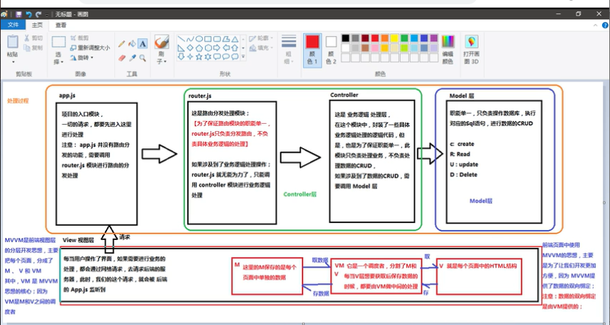

## 1.为啥要学习流行的框架

- 提高效率
- 在Vue中，一个核心概念是，就是让用户不在操作DOM元素，解放了用户的双手
##  2.框架和库的区别
- 框架：是一套完整的解决方案，对项目的侵入性很大，则需要重新整个项目
- 库（插件）：提供了某种工鞥，对项目侵入性很大，很好切换
## 3.Node(后端)中的MVC 与 前端中 MVVM有啥区别
- MVC是后端分层开发的概念
  - 每当用户操作了界面，如果需要进行业务处理，都会通过网络请求，去请求后端的服务器，此时我们的请求，就会被app.js监听到；
    - （1）app.js**项目的入口，一切请求都要进入这里进行处理，app.js并不具有路由分发的功能，需要调用router.js 模块进行路由分发处理** 
    - （2） router.js**为了保证路由模块的智能单一，router.js只负责分发路由，不负责逻辑的处理，如果涉及相关业务逻辑的处理，router.js无法处理，只能调用controller模块**
    - （3）controller **是具体业务逻辑处理的代码，此模块值负责处理业务，不负责处理数据的CRUD，如果需要处理数据，需要调用model层**
    - （4）model **负责连接数据库，进行数据CRUD操作**，
- MVVM 是前端视图层的概念，前端使用该思想，是为了开发更加方便，数据的双向绑定，是VM提供的。主要是关注于
  - MVVM 是针对前端视图层的分层开发思想，主要是把每个页面分为：M、V、VM，其中VM是MVVM思想的核心，因为VM是M和V之间的调度者
  - M：是保存的每个页面的单独的数据，
  - VM：是一个调度者，分割M和VM，是一个中间层，每当V层想要获取保存数据的时候，都需要VM来做中间的处理
  - V：就是每个页面中的html结构
  - 
## vue.js基本语法
- 1.使用mvc 和mvvm的区别
- 2.vue 基本的代码结构
- 3.学习来基本指令：插值表达式，v-cloak v-if，v-for，v-binf，v-show，v-on，v-model，v-html
- 4.事件修饰符：stop prevent capture self once
- 5.el 指定控制的区域，data是个对象，制定了控制的区域内用到的数据，methods 虽然带s 但是是个对象，这里可以自定义方法
- 6.在vm实例中，如果要访问data中的数据，或者访问methods中的方法，必须使用this
- 7.v-for中使用key属性，（只接受string/number）作为唯一key
- 8.v-model 只能应用于 表单元素
- 9.在vue中，绑定样式的两种方式：v-bind.class 和v-bind.style
- 10.vue中watch 的作用是监控一个值的变化，并调用因变化需要执行方法，可以通过watch改变关联的状态

		